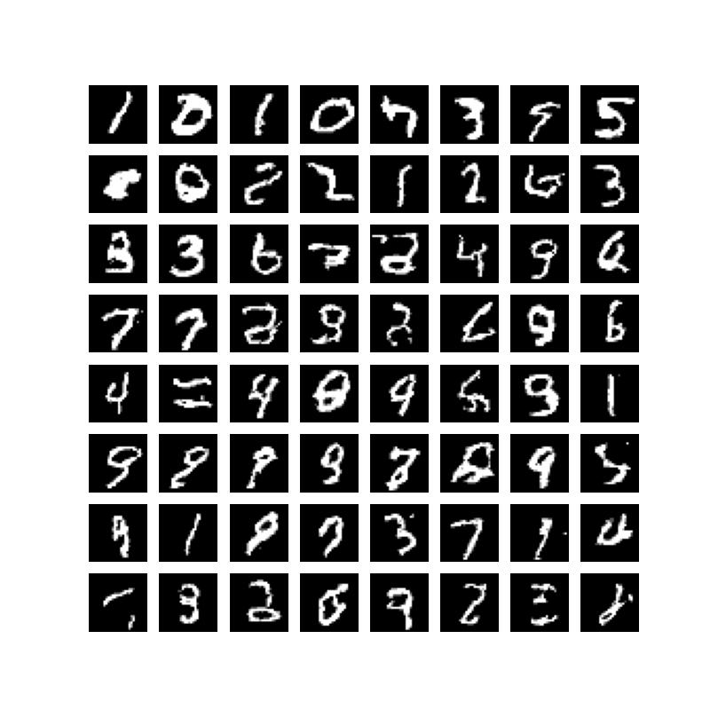

# IGT

* The following is an implementation of a transformer trained to generate samples from MNIST dataset

## Training Datset
* Only MNIST Dataset was used to test due to compute constraint. We have not reported log probabilities, it is a future work on test dataset

## Architecture Details
* Standard Transformer architecture similar to CLM task
* 2 blocks decoder,dmodel=128,dropout=0.1,fc hidden layer 256,mask=True
* Output is probabilites/logits for each 256 pixel for a given position

## Inference
* We take a zero vector of size (B,784)
* We autoregressively generate one pixel at a time (i+1th pixel is generated at ith run)
* Doing this proccess for 783 times generates the required image

## Psuedocode(Training)
* Take an image(MNIST)
* Flatten it to from B,28,28 to B,28*28
* We feed this to the Transformer
* Train using backprop with Adam optimizer, hyperparameters can be found in the code.

## Training Details
* Trained for 22 epochs on colab TPU GPU
* Achieved avg log likelihood on training dataset

## Samples Generated
 
 
## Future changes/work
* Cleaning the code to make it more readable and efficieent
* Trying it as a prior on VQ-VAE
* Scaling the method to generate color image 
* HyperParameter Search
